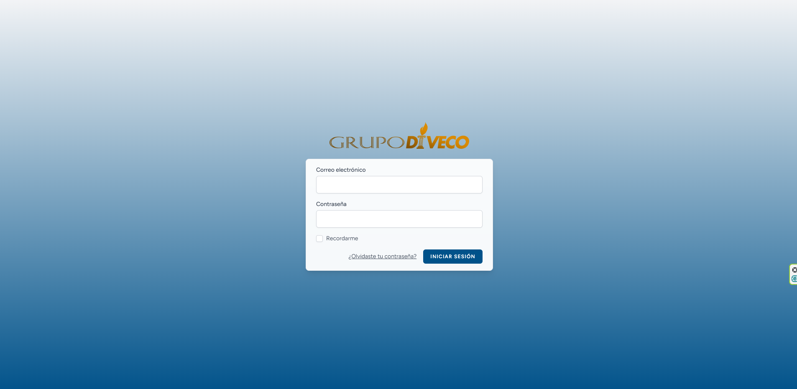
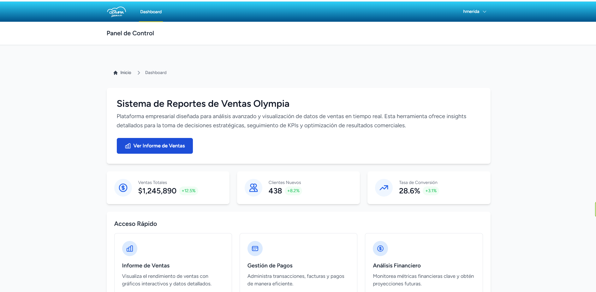
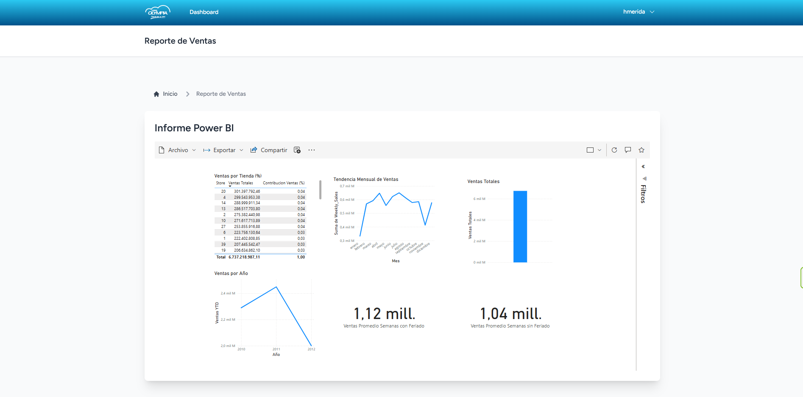

# Aplicación Laravel

Esta es una aplicación Laravel desarrollada para Grupo DIVECO. Entrevista Tecnica de Jonhathan Rolando Rodas Lopez

## Tecnología

Esta aplicación está construida utilizando Laravel Inertia, un paquete oficial que permite crear interfaces de usuario modernas sin sacrificar la simplicidad y potencia de Laravel. Inertia ya proporciona autenticación y todos los aspectos de seguridad comunes, por lo que se optó por usar este paquete en lugar de desarrollar estas funcionalidades desde cero.

Para la construcción de la interfaz de usuario se utilizó Tailwind CSS, un framework de utilidades CSS que facilita la creación de diseños modernos y responsivos sin necesidad de escribir CSS personalizado.

## Vistas previas

### Pantalla de inicio de sesión


### Panel de control


### Informe de Ventas


## Usuarios predeterminados

La aplicación cuenta con un usuario predeterminado para iniciar sesión:

- **Nombre de usuario:** hmerida
- **Correo electrónico:** hmerida@grupo-diveco.com
- **Contraseña:** password

## Instalación

1. Clonar el repositorio
2. Ejecutar `composer install`
3. Configurar el archivo `.env`
4. Ejecutar `php artisan migrate`
5. Ejecutar `php artisan db:seed` para cargar los usuarios predeterminados
6. Ejecutar `npm install`
7. Ejecutar `npm run dev` para compilar los recursos del frontend
9. Ejectuar `php artisan serve` para  ejecutar el proyecto de laravel

## Ejecución en PowerShell

```
Set-ExecutionPolicy -ExecutionPolicy RemoteSigned -Scope CurrentUser
```

